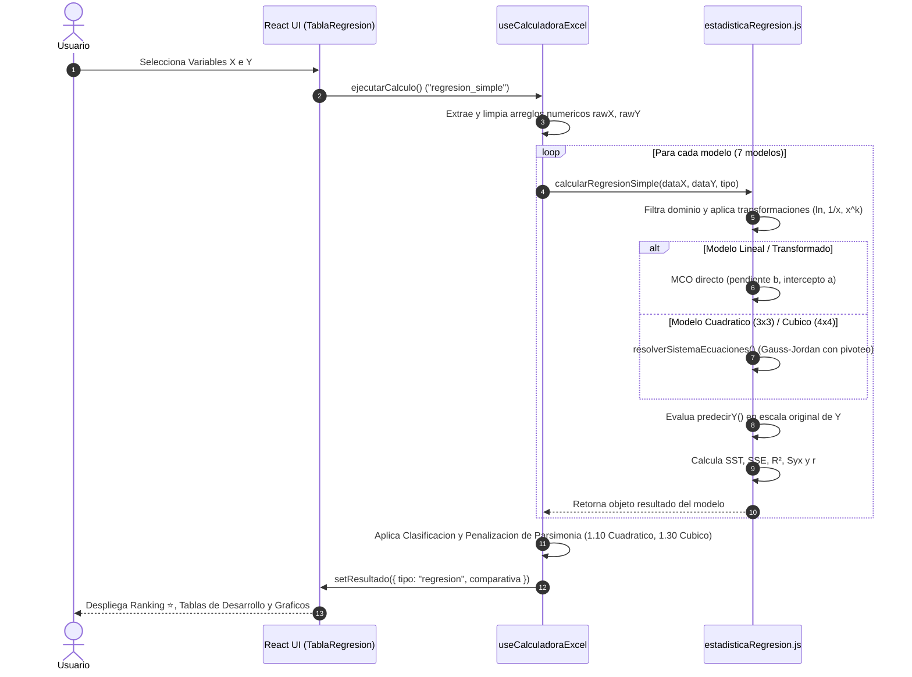

# Informe Técnico: Motor de Regresión y Correlación (MAT151)

**Autor:** Senior Software Engineer & Mathematical Statistics Specialist  
**Proyecto:** Calculadora de Estadística General (MAT151) — Proyecto SHC170  
**Fecha:** 9 de Septiembre de 2026  
**Estado:** Documento de Arquitectura y Especificación Técnica del Sistema Activo  

---

## 1. Resumen de Funcionamiento Lógico y Matemático

### Flujo de Ejecución Activo

El sistema de la **Calculadora de Estadística General (MAT151)** implementa una arquitectura de doble motor para el procesamiento del Análisis de Regresión y Correlación:

1. **Motor Local React (Frontend Dashboard & Excel Viewer)**:
   - **Módulos involucrados**: [`excel-app/src/utils/estadisticaRegresion.js`](file:///c:/Users/ASUS/Desktop/Semestre%201-2026/Trabajo%20Dirigido/Proyecto/Proyecto_SHC170/excel-app/src/utils/estadisticaRegresion.js), [`excel-app/src/hooks/useCalculadoraExcel.js`](file:///c:/Users/ASUS/Desktop/Semestre%201-2026/Trabajo%20Dirigido/Proyecto/Proyecto_SHC170/excel-app/src/hooks/useCalculadoraExcel.js), y [`excel-app/src/components/Resultados/TablaRegresion.jsx`](file:///c:/Users/ASUS/Desktop/Semestre%201-2026/Trabajo%20Dirigido/Proyecto/Proyecto_SHC170/excel-app/src/components/Resultados/TablaRegresion.jsx).
   - **Propósito**: Ejecución síncrona en el cliente para brindar reactividad inmediata al manipular datos de hojas Excel. Calcula simultáneamente los 7 modelos de regresión de la materia, genera tablas de desarrollo paso a paso, formatea ecuaciones en LaTeX y determina el ranking de ajuste óptimo mediante el principio de parsimonia.

2. **Motor Servidor Python (FastAPI Backend REST)**:
   - **Módulos involucrados**: [`api_admin/routers/calculos.py`](file:///c:/Users/ASUS/Desktop/Semestre%201-2026/Trabajo%20Dirigido/Proyecto/Proyecto_SHC170/api_admin/routers/calculos.py), [`api_admin/MAT151/tema6.py`](file:///c:/Users/ASUS/Desktop/Semestre%201-2026/Trabajo%20Dirigido/Proyecto/Proyecto_SHC170/api_admin/MAT151/tema6.py), y [`api_admin/MAT151/tema5.py`](file:///c:/Users/ASUS/Desktop/Semestre%201-2026/Trabajo%20Dirigido/Proyecto/Proyecto_SHC170/api_admin/MAT151/tema5.py).
   - **Propósito**: Atiende peticiones HTTP de cálculo aislado desde componentes como [`Calculator.jsx`](file:///c:/Users/ASUS/Desktop/Semestre%201-2026/Trabajo%20Dirigido/Proyecto/Proyecto_SHC170/excel-app/src/components/excel/Calculator.jsx). Procesa regresiones lineales y polinómicas (grado 2) usando `numpy` y `scikit-learn`, así como regresión multivariante sobre matrices transpuestas.

#### Ciclo de Vida Completo de una Petición (Motor Local)



---

### Resolución Matemática (MCO y Gauss-Jordan)

El motor resuelve los 7 modelos de regresión ajustando parámetros por Mínimos Cuadrados Ordinarios (MCO):

#### 1. Modelos Directos e Intrínsecamente Lineales (MCO Estándar)
Se aplican transformaciones algebraicas sobre $(X, Y)$ para convertirlos en pares $(X', Y')$ sobre los cuales se calcula la pendiente $b$ y el intercepto $a'$ en [`estadisticaRegresion.js:L151-L158`](file:///c:/Users/ASUS/Desktop/Semestre%201-2026/Trabajo%20Dirigido/Proyecto/Proyecto_SHC170/excel-app/src/utils/estadisticaRegresion.js#L151-L158):

- **Lineal**: $X' = X, \quad Y' = Y \implies Y = a + bX$
- **Logarítmica**: $X' = \ln(X), \quad Y' = Y \implies Y = a + b \ln(X)$
- **Exponencial**: $X' = X, \quad Y' = \ln(Y) \implies \ln(Y) = a' + bX \implies Y = a \cdot e^{bX} \quad (a = e^{a'})$
- **Potencial**: $X' = \ln(X), \quad Y' = \ln(Y) \implies \ln(Y) = a' + b \ln(X) \implies Y = a \cdot X^b \quad (a = e^{a'})$
- **Recíproca**: $X' = \frac{1}{X}, \quad Y' = Y \implies Y = a + b\left(\frac{1}{X}\right)$

Fórmulas directas de MCO sobre variables transformadas:

$$b = \frac{n \sum (X' Y') - (\sum X')(\sum Y')}{n \sum (X')^2 - (\sum X')^2}$$

$$a' = \bar{Y}' - b \bar{X}' = \frac{\sum Y' - b \sum X'}{n}$$

#### 2. Modelos Polinomiales (Matrices Gauss-Jordan)
Para los modelos Cuadrático ($Y = a + bX + cX^2$) y Cúbico ($Y = a + bX + cX^2 + dX^3$), se derivan las ecuaciones normales derivando la suma de residuos al cuadrado con respecto a cada coeficiente e igualando a cero:

- **Modelo Cuadrático ($3 \times 3$)** ([`estadisticaRegresion.js:L126-L137`](file:///c:/Users/ASUS/Desktop/Semestre%201-2026/Trabajo%20Dirigido/Proyecto/Proyecto_SHC170/excel-app/src/utils/estadisticaRegresion.js#L126-L137)):
  $$\begin{bmatrix}
  n & \sum X & \sum X^2 \\
  \sum X & \sum X^2 & \sum X^3 \\
  \sum X^2 & \sum X^3 & \sum X^4
  \end{bmatrix}
  \begin{bmatrix} a \\ b \\ c \end{bmatrix}
  =
  \begin{bmatrix} \sum Y \\ \sum XY \\ \sum X^2 Y \end{bmatrix}$$

- **Modelo Cúbico ($4 \times 4$)** ([`estadisticaRegresion.js:L138-L150`](file:///c:/Users/ASUS/Desktop/Semestre%201-2026/Trabajo%20Dirigido/Proyecto/Proyecto_SHC170/excel-app/src/utils/estadisticaRegresion.js#L138-L150)):
  $$\begin{bmatrix}
  n & \sum X & \sum X^2 & \sum X^3 \\
  \sum X & \sum X^2 & \sum X^3 & \sum X^4 \\
  \sum X^2 & \sum X^3 & \sum X^4 & \sum X^5 \\
  \sum X^3 & \sum X^4 & \sum X^5 & \sum X^6
  \end{bmatrix}
  \begin{bmatrix} a \\ b \\ c \\ d \end{bmatrix}
  =
  \begin{bmatrix} \sum Y \\ \sum XY \\ \sum X^2 Y \\ \sum X^3 Y \end{bmatrix}$$

**Algoritmo de Eliminación de Gauss-Jordan con Pivoteo Parcial** ([`estadisticaRegresion.js:L7-L50`](file:///c:/Users/ASUS/Desktop/Semestre%201-2026/Trabajo%20Dirigido/Proyecto/Proyecto_SHC170/excel-app/src/utils/estadisticaRegresion.js#L7-L50)):
1. **Pivoteo Parcial**: Busca el pivote de mayor magnitud absoluta en la columna $i$ entre las filas $k \ge i$ para prevenir errores por división por números cercanos a cero.
2. **Permutación de Filas**: Intercambia la fila del pivote detectado con la fila $i$.
3. **Escalamiento**: Divide la fila $i$ por el valor del pivote $A_{i,i}$. Si $A_{i,i} = 0$, se detecta una matriz singular y se interrumpe la solución devolviendo `null`.
4. **Reducción de Filas**: Resta de todas las demás filas $k \ne i$ el múltiplo correspondiente para hacer 0 la columna $i$, obteniendo la matriz identidad y el vector solución $[a, b, c, d]^T$.

---

### Cálculo de Indicadores Estadísticos

Todos los indicadores de variabilidad y ajuste se computan **estrictamente en la escala original no transformada de la variable dependiente $Y$** ([`estadisticaRegresion.js:L202-L235`](file:///c:/Users/ASUS/Desktop/Semestre%201-2026/Trabajo%20Dirigido/Proyecto/Proyecto_SHC170/excel-app/src/utils/estadisticaRegresion.js#L202-L235)).

#### 1. Reevaluación en Escala Real
Para cada punto original $(X_i, Y_i)$, se calcula la estimación $\hat{Y}_i$ usando la función predictora `predecirY(xVal)` ([`estadisticaRegresion.js:L202-L211`](file:///c:/Users/ASUS/Desktop/Semestre%201-2026/Trabajo%20Dirigido/Proyecto/Proyecto_SHC170/excel-app/src/utils/estadisticaRegresion.js#L202-L211)):
- Lineal: $\hat{Y} = a + bX$
- Logarítmica: $\hat{Y} = a + b \ln(X)$
- Exponencial: $\hat{Y} = a \cdot e^{bX}$
- Potencial: $\hat{Y} = a \cdot X^b$
- Recíproca: $\hat{Y} = a + b(1/X)$
- Cuadrática: $\hat{Y} = a + bX + cX^2$
- Cúbica: $\hat{Y} = a + bX + cX^2 + dX^3$

#### 2. Sumas de Cuadrados y Coeficiente de Determinación ($R^2$)
$$SST = \sum_{i=1}^n (Y_{i,\text{orig}} - \bar{Y}_{\text{orig}})^2, \quad SSE = \sum_{i=1}^n (Y_{i,\text{orig}} - \hat{Y}_i)^2$$

$$R^2 = 1 - \frac{SSE}{SST} \quad (\text{si } SST \neq 0, \text{ de lo contrario } 0)$$

#### 3. Error Estándar de la Estimación ($S_{yx}$) con Penalización por Grados de Libertad
Para evitar sobreestimar la precisión al agregar parámetros, el sistema descuenta los grados de libertad consumidos $p$:

$$S_{yx} = \begin{cases} 
\sqrt{\frac{SSE}{n - p}} & \text{si } n > p \\ 
0 & \text{en otro caso} 
\end{cases}$$

- **Modelos de 2 Parámetros** ($p = 2$: Lineal, Log, Exp, Pot, Recíproco): $S_{yx} = \sqrt{\frac{SSE}{n - 2}}$
- **Modelo Cuadrático** ($p = 3$): $S_{yx} = \sqrt{\frac{SSE}{n - 3}}$
- **Modelo Cúbico** ($p = 4$): $S_{yx} = \sqrt{\frac{SSE}{n - 4}}$

#### 4. Coeficiente de Correlación ($r$)
- **Modelos Monótonos (Lineal, Log, Exp, Pot)**: $r = \operatorname{signo}(b) \cdot \sqrt{\max(0, R^2)}$.
- **Modelo Recíproco**: Debido a que la derivada es $\frac{dY}{dX} = -\frac{b}{X^2}$, la dirección de la relación es opuesta al signo de $b$: $r = \operatorname{signo}(-b) \cdot \sqrt{\max(0, R^2)}$.
- **Polinomios (Cuadrático, Cúbico)**: Se reporta la Correlación Múltiple $R = \sqrt{\max(0, R^2)}$, la cual es siempre no negativa.

---

### Criterio de Selección del Modelo Óptimo

Para seleccionar el modelo con el mejor ajuste (marcado con ⭐ en la interfaz), el sistema aplica en [`useCalculadoraExcel.js:L211-L243`](file:///c:/Users/ASUS/Desktop/Semestre%201-2026/Trabajo%20Dirigido/Proyecto/Proyecto_SHC170/excel-app/src/hooks/useCalculadoraExcel.js#L211-L243) un algoritmo basado en el **Principio de Parsimonia**:

```javascript
// Factores de penalización por parsimonia
const factor_a = nombreA.includes('cubica') ? 1.30 : (nombreA.includes('cuadratica') ? 1.10 : 1.0);
const score_a = s_a * factor_a;
const score_b = s_b * factor_b;

const diffError = score_a - score_b;
if (Math.abs(diffError) < 1e-9) return r2_b - r2_a; // Desempate por R²
return diffError;
```

1. **Penalización por Parsimonia**:
   - Modelos de 2 parámetros: Factor de ponderación $= 1.00$
   - Modelo Cuadrático (3 parámetros): Factor de ponderación $= 1.10$ ($+10\%$ de penalización sobre $S_{yx}$)
   - Modelo Cúbico (4 parámetros): Factor de ponderación $= 1.30$ ($+30\%$ de penalización sobre $S_{yx}$)
2. **Clasificación**: Se ordenan los modelos ascendentemente por su **Puntaje de Error Ajustado** ($\text{Score} = S_{yx} \times \text{Factor}$).
3. **Criterio de Desempate**: Si dos modelos presentan un Puntaje de Error Ajustado prácticamente idéntico ($|\Delta \text{Score}| < 10^{-9}$), desempata el modelo con mayor $R^2$.

---

## 2. Estructura y Requisitos de Datos

### Interfaces y Esquemas

#### 1. Firma del Motor Cliente Javascript ([`estadisticaRegresion.js`](file:///c:/Users/ASUS/Desktop/Semestre%201-2026/Trabajo%20Dirigido/Proyecto/Proyecto_SHC170/excel-app/src/utils/estadisticaRegresion.js#L55))

```typescript
type TipoRegresion = "lineal" | "logaritmica" | "exponencial" | "potencial" | "reciproco" | "cuadratica" | "cubica";

interface IndicadoresRegresion {
  r2: number;
  r: number;
  error_estandar: number;
}

interface ResultadoRegresionModelo {
  tipoModelo: TipoRegresion;
  n_validos: number;
  ecuacion: string;
  ecuacionLatex: string;
  formaCorrelacionalLatex: string;
  formaCorrelacionalTexto: string;
  indicadores: IndicadoresRegresion;
  datosGrafico: Array<{ x: number; yReal: number }>;
  funcionPredictora: (xVal: number) => number;
  tablaCalculos: {
    filas: Array<{
      xOrig: number; yOrig: number;
      xTrans: number; yTrans: number;
      x2: number; y2: number; xy: number;
      x3?: number; x4?: number; x5?: number; x6?: number;
      x2y?: number; x3y?: number;
    }>;
    sumas: Record<string, number>;
  };
}

export function calcularRegresionSimple(
  arrX: Array<number>, 
  arrY: Array<number>, 
  tipo: TipoRegresion
): ResultadoRegresionModelo | null;
```

#### 2. Modelos Backend Pydantic ([`api_admin/routers/calculos.py`](file:///c:/Users/ASUS/Desktop/Semestre%201-2026/Trabajo%20Dirigido/Proyecto/Proyecto_SHC170/api_admin/routers/calculos.py#L35-L60))

```python
from pydantic import BaseModel
from typing import List

class DataBivariada(BaseModel):
    x: List[float]
    y: List[float]
    tipo: str  # "covarianza" | "correlacion" | "regresion_lineal" | "regresion_no_lineal"

class DataMultivariante(BaseModel):
    X: List[List[float]]  # Matriz transpuesta de variables independientes
    y: List[float]
    tipo: str  # "regresion_multivariante"
```

---

### Restricciones de Dominio Numérico

Para evitar fallos en tiempo de ejecución o errores matemáticos (división por cero, logaritmos de números no positivos, matrices singulares), el motor ejecuta un filtrado previo de validez ([`estadisticaRegresion.js:L59-L67`](file:///c:/Users/ASUS/Desktop/Semestre%201-2026/Trabajo%20Dirigido/Proyecto/Proyecto_SHC170/excel-app/src/utils/estadisticaRegresion.js#L59-L67)):

| Caso Borde Numérico | Modelos Afectados | Condición de Invalidez | Error Matemático Evitado |
| :--- | :--- | :--- | :--- |
| **$X \le 0$** | Logarítmico, Potencial | `x <= 0` | Indefinición del logaritmo natural ($\ln(X) \to -\infty$ o indf. en $\mathbb{R}$). |
| **$Y \le 0$** | Exponencial, Potencial | `y <= 0` | Indefinición de la transformación logarítmica en $Y$ ($\ln(Y)$ indf. para $Y \le 0$). |
| **$X = 0$** | Recíproco | `x === 0` | División por cero al calcular $\frac{1}{X}$. |
| **Valores nulos / NaN** | Todos | `typeof !== 'number' \|\| isNaN()` | Propagación de `NaN` en las sumatorias MCO. |
| **Varianza $X$ nula ($\sum X^2 = \frac{(\sum X)^2}{n}$)** | Lineal / Transformados | `denominador === 0` | Puntos alineados verticalmente; pendiente infinita. Retorna `null`. |
| **Matriz Singular (Pivote = 0)** | Cuadrático, Cúbico | `pivote === 0` | Puntos colineales o sistema indeterminado en Gauss-Jordan. Retorna `null`. |

---

### Límites de Muestra ($n$)

Para resolver los coeficientes y calcular el Error Estándar de la Estimación ($S_{yx}$) sin división por cero en los grados de libertad, se exige un número mínimo de pares de datos válidos:

| Modelo | Parámetros ($p$) | Mínimo para Resolver Coeficientes | Mínimo para Grados de Libertad ($n > p$) | Resultado si $n < n_{\text{min}}$ |
| :--- | :---: | :---: | :---: | :--- |
| **Lineal, Log, Exp, Pot, Recíproco** | 2 | $n = 2$ | **$n \ge 3$** | Retorna `null` por insuficiencia de puntos ([`L72`](file:///c:/Users/ASUS/Desktop/Semestre%201-2026/Trabajo%20Dirigido/Proyecto/Proyecto_SHC170/excel-app/src/utils/estadisticaRegresion.js#L72)). |
| **Cuadrático** | 3 | $n = 3$ | **$n \ge 4$** | Retorna `null`. Requiere al menos 4 puntos para evaluar $S_{yx} = \sqrt{\frac{SSE}{n-3}}$. |
| **Cúbico** | 4 | $n = 4$ | **$n \ge 5$** | Retorna `null`. Requiere al menos 5 puntos para evaluar $S_{yx} = \sqrt{\frac{SSE}{n-4}}$. |
